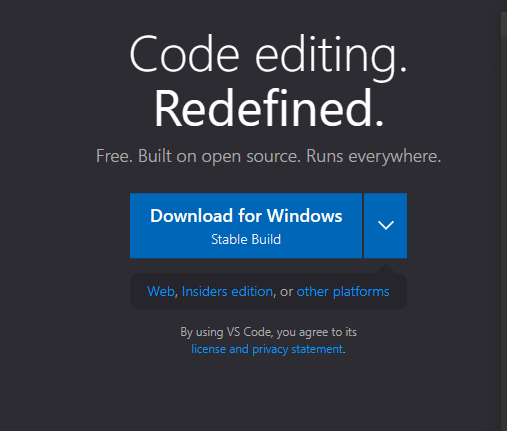
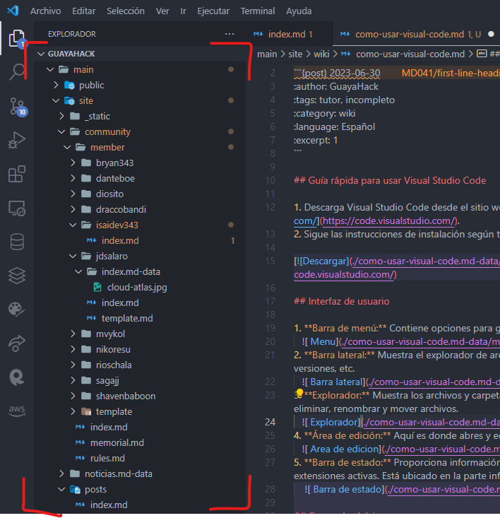
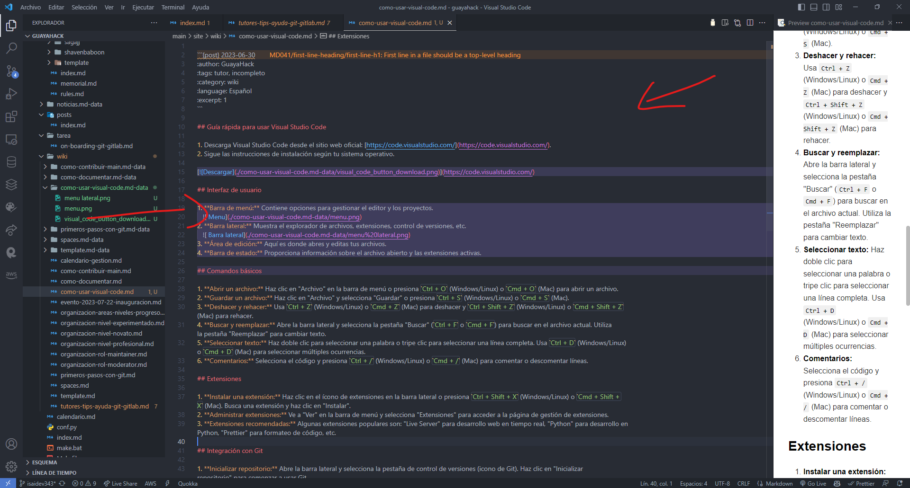
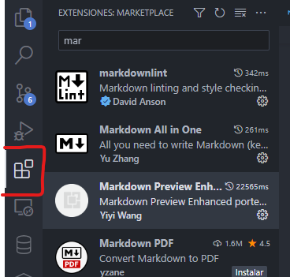
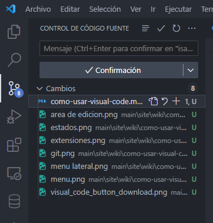
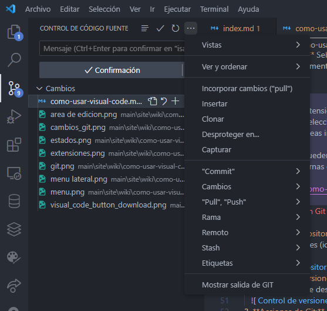

```{post} 2023-07-22
:tags: newbie, ide, vscode, destacado
:category: wiki
:language: Español
:excerpt: 1
```

# Guía rápida para usar Visual Studio Code

1. Descarga Visual Studio Code desde el sitio web oficial: [https://code.visualstudio.com/](https://code.visualstudio.com/).
2. Sigue las instrucciones de instalación según tu sistema operativo.

    [](https://code.visualstudio.com/)

## Interfaz de usuario

1. **Barra de menú:** Contiene opciones para gestionar el editor y los proyectos.
   
2. **Barra lateral:** Muestra el explorador de archivos, extensiones, control de versiones, etc.
   
3. **Explorador:** Muestra los archivos y carpetas de tu proyecto. Puedes crear, eliminar, renombrar y mover archivos.
   
4. **Área de edición:** Aquí es donde abres y editas tus archivos. Puedes cambiar entre archivos haciendo clic en sus pestañas.
   
5. **Barra de estado:** Proporciona información sobre el archivo abierto y las extensiones activas. Está ubicado en la parte inferior de la ventana.
    

## Comandos básicos

Todos estos comandos se pueden encontrar en la barra de menú. Pero también puedes usar los atajos de teclado que se muestran a continuación.

1. **Abrir un archivo:** Haz clic en `Archivo` en la barra de menú o presiona `Ctrl + O` (Windows/Linux) o `Cmd + O` (Mac) para abrir un archivo.
2. **Guardar un archivo:** Haz clic en "Archivo" y selecciona "Guardar" o presiona `Ctrl + S` (Windows/Linux) o `Cmd + S` (Mac).
3. **Deshacer y rehacer:** Usa `Ctrl + Z` (Windows/Linux) o `Cmd + Z` (Mac) para deshacer y `Ctrl + Shift + Z` (Windows/Linux) o `Cmd + Shift + Z` (Mac) para rehacer.
4. **Buscar y reemplazar:** Abre la barra lateral y selecciona la pestaña "Buscar" (`Ctrl + F` o `Cmd + F`) para buscar en el archivo actual. Utiliza la pestaña "Reemplazar" para cambiar texto.
5. **Seleccionar texto:** Haz doble clic para seleccionar una palabra o tripe clic para seleccionar una línea completa. Usa `Ctrl + D` (Windows/Linux) o `Cmd + D` (Mac) para seleccionar múltiples ocurrencias.
6. **Comentarios:** Selecciona el código y presiona `Ctrl + /` (Windows/Linux) o `Cmd + /` (Mac) para comentar o descomentar líneas.

## Extensiones

Puedes instalar extensiones desde la tienda de extensiones de Visual Studio Code. Abre la barra lateral y selecciona la pestaña de extensiones (icono de cubo). Busca la extensión que deseas instalar, haz clic en **"Instalar"** y luego en **"Recargar"** para activarla.
Las extensiones pueden agregar nuevas características a VS Code o **integrarse** con herramientas externas como linters, editores de texto, formateadores, etc.



## Integración con Git

1. **Inicializar repositorio:** Abre la barra lateral y selecciona la pestaña de control de versiones (icono de Git). Puedes inicializar un repositorio o clonar uno existente.
   
2. **Control de versiones:** Verás los cambios sin guardar en el área de "Cambios". Escribe un mensaje descriptivo y haz clic en ✓ para confirmar los cambios.
   
3. **Acciones de Git:** Haz clic en los tres puntos para acceder a las acciones de Git. Aquí puedes crear una nueva rama, hacer un pull, push, etc.
   

## Personalización

1. **Temas:** Ve a `Archivo` > `Preferencias` > `Color del tema` para cambiar la apariencia de VS Code.
2. **Configuración:** Personaliza tu editor a través de `Archivo` > `Preferencias` > `Configuración`.
3. **Atajos de teclado:** Si no te gusta el esquema de teclas predeterminado, puedes cambiarlo yendo a `Archivo` > `Preferencias` > `Atajos de teclado`.

¡Listo! Con esta guía corta, deberías poder dar tus primeros pasos, recuerda que la mejor forma de aprender es practicando.

Puedes ver mas tutoriales en la las categorías **Blogs** y **WIKI** de la comunidad.

